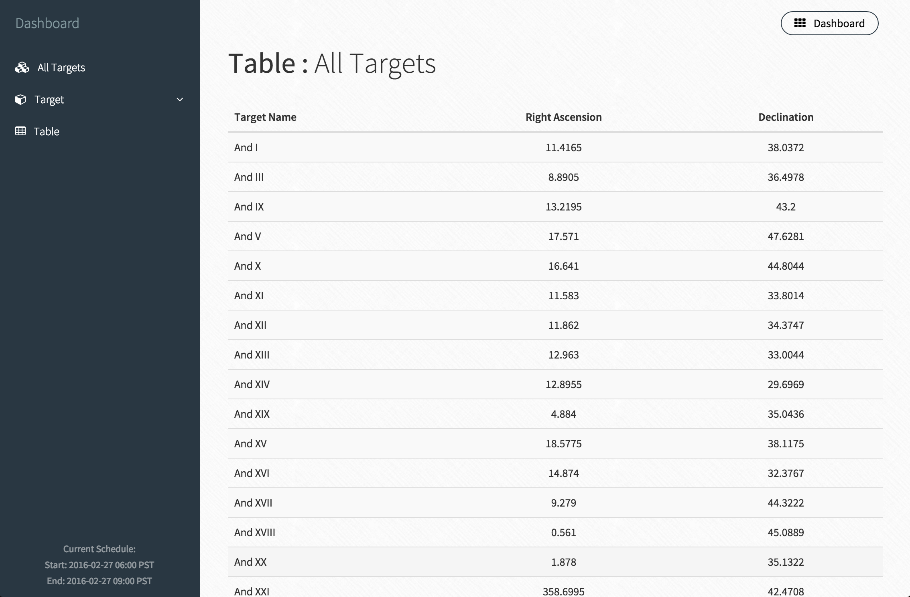

# gbt-tool

Isolates observable targets (from a database) using times scraped from the GBT Schedule.

**Update:**

  - Uses multiprocessing to allow up to 1.7x speedup over previous version.
  - Supports connecting to remote database server over ssh-tunnel.
  - Improved Command-Line Interface (CLI) and created a HTML dashboard.

**Pre-requisites:**

  - <a href="http://continuum.io/downloads">Anaconda</a> distribution.
  - Astoplan package: `pip install astroplan`
  - SQLAlchemy package: `pip install SQLAlchemy`
  - Astropy package: `pip install astropy`
  - Node Webserver: `npm install http-server -g`

**SSH Tunneling & Launching Local Webserver:**  

For the script to run on the local machine, setup a ssh-tunnel on port 3307 to the remote server with the MySQL database: `ssh -L 3307:127.0.0.1:3306 `*`username@remote_host`*.

> Note: `3307:localhost:3306` will not work due to how MySQL establishes connections through networks.

Then, in a separate terminal window, launch a local webserver with: `http-server ./html/ -p 8000`.

**Usage:**

*Terminal*

  - Add more `constraints` in the `"__main__"` section.

    > If required, `import` from `astroplan` more `Constraint` modules.

  - Run the script: `$ python gbt.py` from the terminal. You should see the following:
  
    - A command-line greeting: `Initializing...`
    
    - A schedule of observations will be displayed. Select one and input into the prompt: `Select Schedule Index:`.
    
    - Processing information: `Acquiring Targets...`.
    
    - Request to enter password to access database: `Password:`.
    
    - Processing information: `Generating Plots...`
    
    - A web browser should open a webpage and a command-line notice is given: `Dashboard serving at http://localhost:8000`.

  - Navigating the HTML Dashboard:
   
    - The main view, , showing all the targets in the start and end times of the observation window: 
    
        

    - The individual target view, , showing the path taken by each target from the list:
    
        
      
    - The table view, , showing the list of all targets sorted alphabetically:
    
        
      
    - Verify the current schedule information at the lower-left corner in the dashboard:
    
       

*Script/Interpreter*

  - Begin by `import`ing the class: `from gbt import *`.
  - Create a `constraints` list e.g.:

    > `constraints = [AltitudeConstraint(40*u.deg,80*u.deg), SunSeparationConstraint(20*u.deg)]`.

  - Initialize the tool with `constraints`: `tool = GBTObservables(constraints)`.
  
  - View the list of possible schedules: `tool.viewScheduleAsTable()`.
  
  - Get more information about a schedule with index `n`: `tool.viewSchedule(n)`.
  
  - Get filter object and generate list of observable targets for `n`-th schedule (*zero-endexed*): `filter,targets = tool.getTargets(n)`.
  
  - Use both `filter` object and `targets` list to generate plots:
  
    > Plot of all targets at start and end of observation: `tool.generateGlobalPlots(filter,targets)`. 

    > Plot of individual target path plots during observation: `tool.generatePathPlots(filter,targets)`.
    
    *Note: The global plots are stored in `./html/img/global/` and the path plots are stored in `./html/img/targets/`.*
